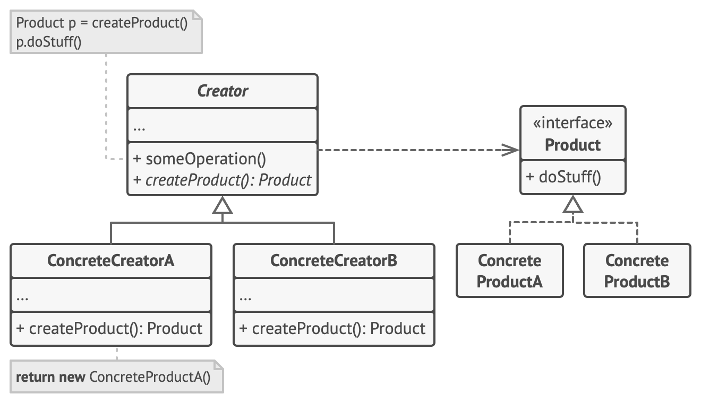

Abstract Creator Recap
The Abstract Creator is essential because it provides a consistent interface for the creation of objects. It ensures that:

The client code depends only on the abstraction (Notification, Transport, etc.).
New concrete implementations (like PushNotification or Airplane) can be added with minimal changes in one central place (the factory) without affecting the rest of the application.
Why Can’t We Just Call the Abstract Product Directly?
You might think, "If we have an abstract product (Notification, Transport, etc.), why not just instantiate the products directly, skipping the Abstract Creator?" Here's why:

Violation of the Open/Closed Principle:

If the client code directly creates new EmailNotification() or new SMSNotification(), you’d need to modify every piece of client code whenever a new product is added. This introduces high coupling and violates the Open/Closed Principle (code should be open for extension but closed for modification).
Encapsulation of Object Creation:

The Abstract Creator centralizes object creation. Without it, the client is burdened with the logic to decide which product to create, which makes the client responsible for knowledge it shouldn’t have.
Code Consistency:

The Abstract Creator ensures all client code uses a unified approach to instantiate products, even if the logic for creating those products is complex or requires additional steps.
Refined Example: Abstract Creator at Work
Let’s make this more concrete by revisiting the Notification Example, but this time without the Abstract Creator versus with the Abstract Creator.

Case 1: Without Abstract Creator
Here, the client code directly uses the Notification interface and its concrete classes.

java
Copy code
public class Client {
public static void main(String[] args) {
String notificationType = "PUSH";

        Notification notification;
        switch (notificationType) {
            case "EMAIL":
                notification = new EmailNotification();
                break;
            case "SMS":
                notification = new SMSNotification();
                break;
            case "PUSH":
                notification = new PushNotification();
                break;
            default:
                throw new IllegalArgumentException("Unknown notification type");
        }

        notification.notifyUser(); // Output depends on notificationType
    }
}
Issues:
The client code (main) is tightly coupled with EmailNotification, SMSNotification, and PushNotification.
Every time a new product (e.g., WhatsAppNotification) is added, you must update the client (switch logic).
The client needs to know how to create products, which breaks encapsulation.
Case 2: With Abstract Creator
The Abstract Creator moves object creation out of the client.

java
Copy code
// Client code
public class Client {
public static void main(String[] args) {
// Dynamically get a creator from a factory
NotificationCreator creator = NotificationFactory.getNotificationCreator("PUSH");

        // Delegate the creation to the Abstract Creator
        creator.notifyUser(); // Output: Sending Push Notification
    }
}
Now, the Abstract Creator and Factory handle product creation.

Benefits:
Client Code Simplified:

The client delegates product creation to the NotificationCreator. It doesn’t need to know the product details or how to create them.
Minimal Changes When Adding New Products:

Add a new product (WhatsAppNotification), update the factory selector in one place, and you’re done.
Encapsulation:

The Abstract Creator (NotificationCreator) hides the details of how objects are created, ensuring clients don’t need to know about constructors or internal product logic.
Why Is This Better?
Let’s extend the example to add PushNotification and analyze the differences:

Without Abstract Creator:
You’d need to:
Add PushNotification to the client’s switch logic.
Update multiple client locations if they all manage their own creation logic.
With Abstract Creator:
You’d only:
Create a PushNotificationCreator class.
Update the factory selector in one place (NotificationFactory).
Client code remains untouched.
Reflection in This Context
When using reflection, even the factory logic for new products can be simplified. This eliminates the need to modify the factory selector:

Add a new product (PushNotification).
Register it dynamically at runtime:
java
Copy code
NotificationFactory.registerNotification("PUSH", PushNotificationCreator.class);
No other part of the code changes.
Summary of Abstract Creator's Benefits
Flexibility: You can easily add new products (or remove them) without rewriting client code.
Encapsulation: The client doesn’t care about how products are created—only how to use them.
Consistency: A standardized way to instantiate products ensures fewer bugs and easier maintenance.
Scalability: The application scales more cleanly with new types of products