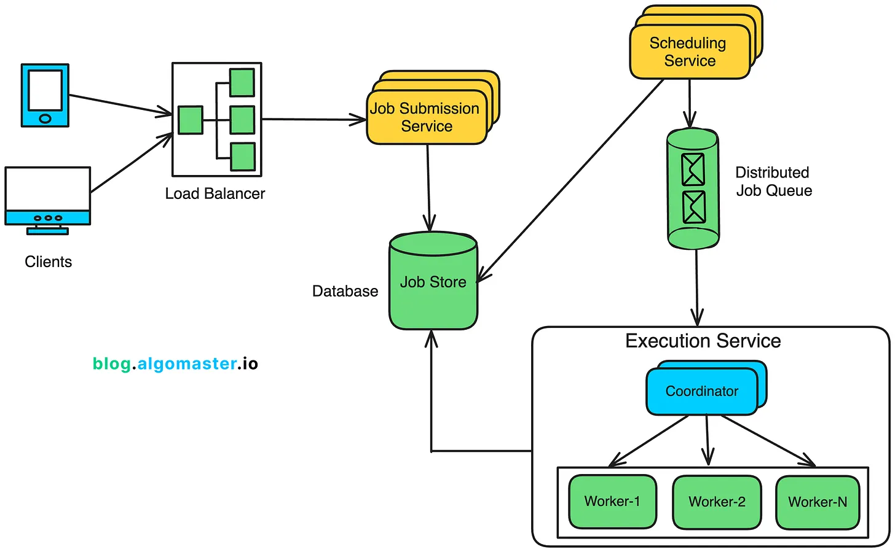
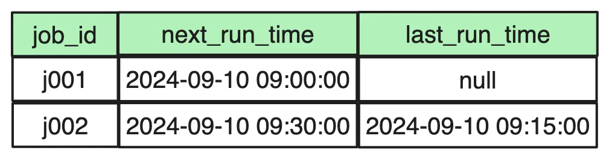

* A distributed job scheduler is a system designed to manage, schedule, and execute tasks (referred to as "jobs") across multiple computers or nodes in a distributed network

### JOB SCHEDULING SERVICE -
https://blog.algomaster.io/p/design-a-distributed-job-scheduler

Venkat Explanation link

https://paypal-my.sharepoint.com/:v:/p/gnank/EblbddDeOuZBmtB_mJF4WDIB8y1r-zXurui9sAkBbcbKEA?referrer=Teams.TEAMS-ELECTRON&referrerScenario=MeetingChicletGetLink.view

**_NOSQL_ for storing job data** -  but given the scale and nature of the workload, a NoSQL database like 
DynamoDB or Cassandra could be a better fit, 
especially when handling millions of jobs per day
and supporting high-throughput writes and reads.
## High Level Design

**Scheduling Service**

The Scheduling Service is responsible for selecting jobs for
execution based on their next_run_time in the Job Schedules Table.

    SELECT * FROM JobSchedulesTable WHERE next_run_time = 1726110000;

    SELECT * FROM JobSchedulesTable WHERE next_run_time = 1726110000
    AND segment in (1,2);

## **Addressing Single Points of Failure**
We are using a coordinator node in both the Scheduling and Execution service.

To prevent the coordinator from becoming a single point of failure,
deploy multiple coordinator nodes with a **leader-election mechanism.**

##### . Tools like **_Zookeeper_** or etcd are commonly
used for managing distributed leader elections.

## 📌
## ⚙
## 🗂️ 
### ✅ 
## 💻 

## 📚 Books

