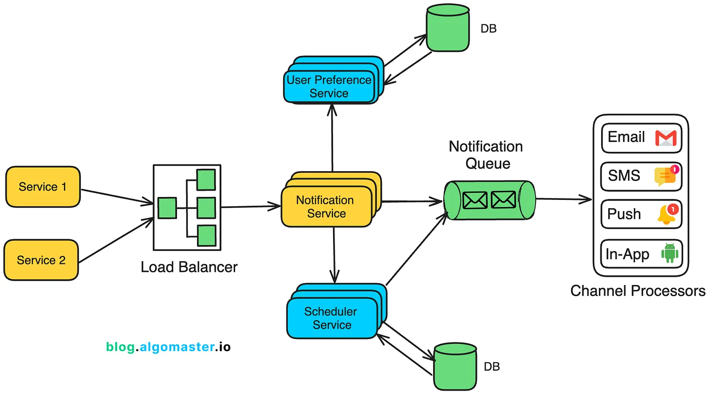
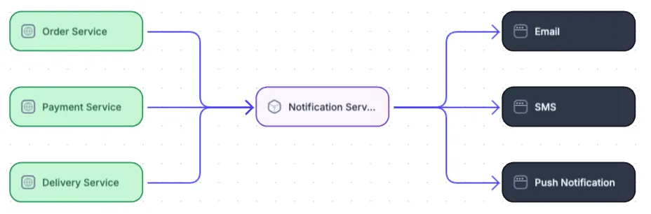
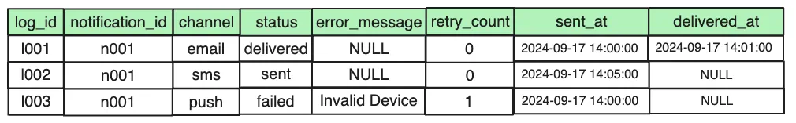

* Design a scalable notification service that can handle of millions of notifications per day and ensure high availability.

### NOTIFICATION SERVICE -
https://blog.algomaster.io/p/design-a-scalable-notification-service

**Transactional Data:** A relational database like **PostgreSQL or MySQL** stores structured data, such as notification logs and delivery status.

**User Preferences:** NoSQL databases (e.g., DynamoDB, MongoDB) store large volumes of user-specific data, such as preferences and rate limits.

**Blob Storage:** For notifications containing large attachments (e.g., email with images or PDFs), Amazon S3 or similar services can store them.

## High Level Design

**Notification Service**

These could be requests to send transactional notifications (e.g., password reset emails), promotional notifications (e.g., discount offers), or system alerts (e.g., downtime warnings).

For notifications that need to be sent at a future date or time, the Notification Service integrates with the Scheduler Service.

After processing the request, the Notification Service pushes the notifications to a Notification Queue (e.g., Kafka or RabbitMQ).

## **Notification Service**
It stores and retrieves individual user preferences for receiving notifications across different channels.

The service tracks which types of notifications users have explicitly opted into or out of.

    Example: Users may opt out of marketing or promotional content
              A user may only receive 2 promotional notifications per day

## **Scheduler Service** -- time-based database or NoSQL database
Example: A promotional message might be scheduled for delivery next week.

Once the scheduled time arrives, the Scheduler Service pulls the notification from its storage and sends it to the Notification Queue.

Every minute (or based on a more granular interval), the service queries for notifications that need to be delivered in the next time window (e.g., next 1–5 minutes).

When the scheduled time arrives, the Scheduler Service takes the notification and sends it to the Notification Queue.

## 📌Notification Queue
Depending on the use case, it can be configured for:

At-least-once delivery: Ensures that every notification will be sent at least once, even if this results in duplicate messages in rare cases.

Exactly-once delivery: Ensures that every notification is delivered exactly once, preventing duplicates while maintaining reliability.

## ⚙ Queueing the Notification
Each channel (email, SMS, push, etc.) has its own dedicated topic, ensuring that the messages are processed independently by the relevant Channel Processors.

Example: If the notification needs to be sent via email, SMS, and push, the Notification Service generates three messages, each tailored to the respective channel.

The Email Message is placed into the Email Topic.

The SMS Message is placed into the SMS Topic.

The Push Notification Message is placed into the Push Topic.

## 🗂️ Channel-Specific Message Processing
Each channel processor acts as a consumer to the queue and responsible for consuming its own messages:

Email Processor pulls from the Email Topic.

SMS Processor pulls from the SMS Topic.

Push Processor pulls from the Push Topic.

In-app Processor pulls from the In-app Topic.

### ✅ Sending the Notification
1. Email Processor: - connects to email provider like (e.g., SendGrid, Mailgun, Amazon SES
2. SMS Processor - connects to SMS provider like (e.g., Twilio, Nexmo).
3. Push Notification Processor: Uses services like Firebase Cloud Messaging (FCM) for Android or Apple Push Notification Service (APNs) for iOS.
4. In-App Notification Processor: - Sends the in-app notification via WebSockets or long polling to the user’s active session.

## 💻 Monitoring and Delivery Confirmation

## 📚 Books

