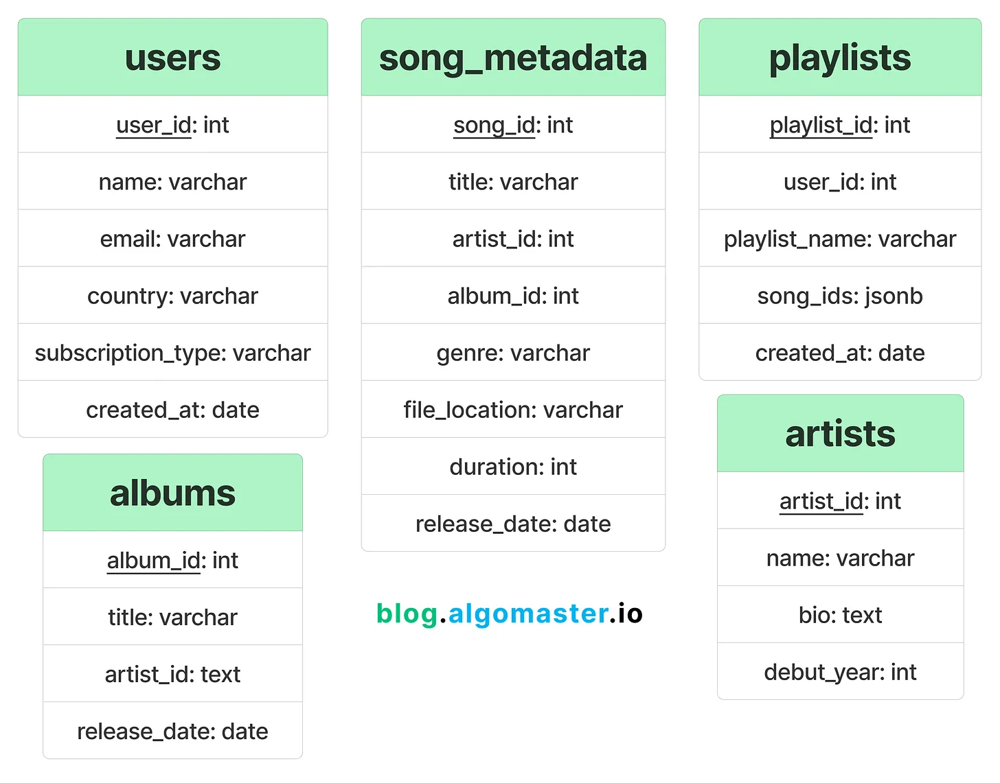
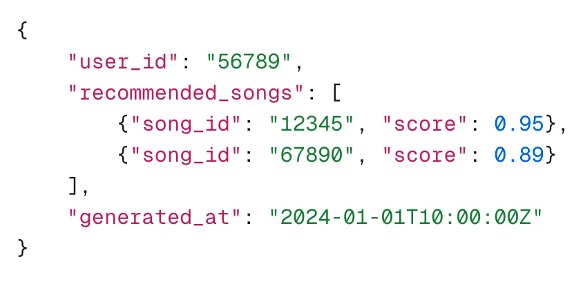
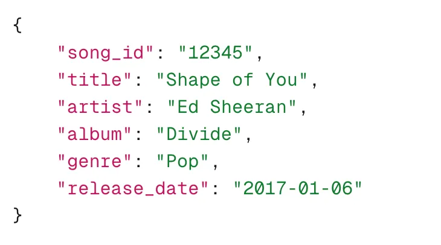
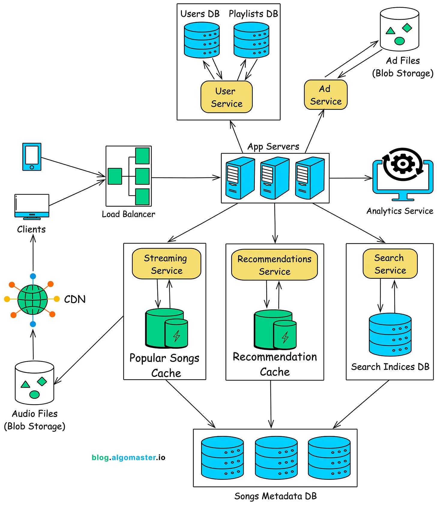

* A distributed job scheduler is a system designed to manage, schedule, and execute tasks (referred to as "jobs") across multiple computers or nodes in a distributed network

### SPOTIFY-
https://blog.algomaster.io/p/design-spotify-system-design-interview

combination of relational databases, NoSQL databases, and distributed storage systems.

## Relational Databases for Structured Data

## NoSQL Databases for Unstructured Data
Spotify generates recommendations for users based on their listening behavior and this data is updated frequently.

Example Record:

earch indices are stored in NoSQL databases like Elasticsearch to allow quick, fuzzy search queries across songs, artists, and albums.

These indices are continuously updated as new content is added.

Example Record:

## Distributed Storage System like Amazon s3 for storing large volumes of audio and ad files
## High Level Design

**Caching  Estimation**

Caching plays a significant role in reducing the load on the storage system and ensuring low latency for popular content.

Frequently played song metadata can be cached in memory.

Lets assume top 20% songs contribute to 80% of the requests.

Assuming Spotify has 100 million songs and the top 20% are cached.

Cache size = 20 million songs × 2 KB/song = 40 GB.

## **Storage**
Databases: Stores user profiles, playlists, songs metadata and search indices.

Blob Storage: A distributed storage system (e.g., AWS S3) for handling large-scale storage of audio and ad files.

Content Delivery Network (CDN): Used to deliver large audio files efficiently to users across the globe with minimal latency.

Caches: Caches frequently accessed data such as popular songs and recommendations to improve performance and reduce the load on the storage and database systems.

##  Analytics and Monitoring Data (Data Warehousing)
Analytics and monitoring data are critical for tracking user engagement, system performance, and identifying potential issues.

Data is aggregated and processed in a data warehouse or distributed data stores (e.g., Hadoop, BigQuery).

**Key Use Cases for Analytics:**

User Engagement: Data on streams, skips, and playlist additions are used to generate insights into user behavior.

System Monitoring: Logs from various services are used to monitor system health, detect anomalies, and perform performance tuning.

#### **Royalty Calculations:** Streaming data is used to calculate payments for artists based on song plays and geographic reach.

##  Recommendation Service

####   1.Recommendation Service 
    User-Based Collaborative Filtering, Item-Based Collaborative Filtering

#### 2. Content-Based Filtering
    Song Attributes,Artist Similarity

## 📌 Search Service
The architecture of Search Service can be broken down into the following key components:
        
     Query Parser,Search Index,Ranking Engine,Personalization Layer,
     Search Autocomplete,Cache Layer,Search Index Updater
## ⚙
## 🗂️ 
### ✅ 
## 💻 

## 📚 Books

