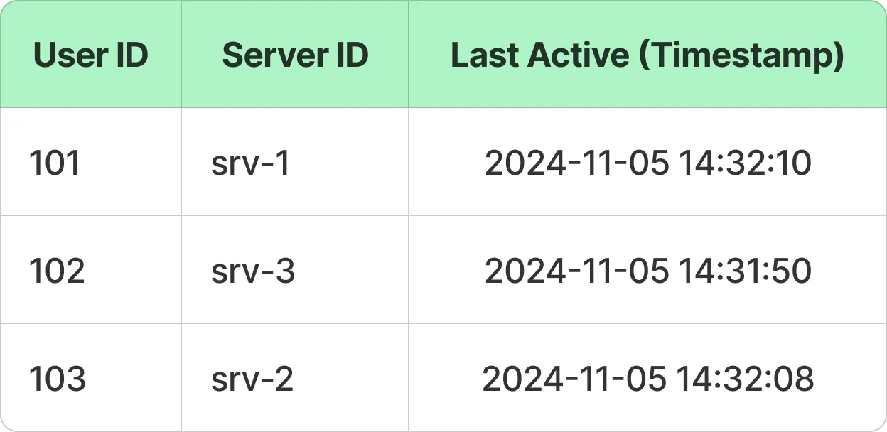

### WHATSAPP - Important task - concurrent connections-**_WebSocket_** ideal for real-time communication,
https://blog.algomaster.io/p/design-a-chat-application-like-whatsapp

### **time-based message ID.**
    [Timestamp in milliseconds][Unique Sequence/Random Component]

    ** This allows us to order messages by timestamp, 
      retrieve messages within a specific time range and support pagination (“load more“)
      where you retrieve messages before or after a specific 
      timestamp without re-sorting the dataset.**

With 10 million users connected concurrently during peak times.

Average Bandwidth per Connection: Assuming an average of 10 KB/s per connection,
we would need a total of 100 GB/s of bandwidth to support real-time messaging at peak usage.

## High Level Design

**Message DB- CASSANDRA - HIGH WRITE THROUGHPUT**

To store the **user, group and conversations** data-> SQL database like PostgreSQL.

For message data, it’s preferred to use a **NoSQL database like Cassandra** due to high-write throughput.

For **media files**, an object store like **AWS S3** provides scalable and secure storage.

## Tech Stack Used
* **Redis** to store **user connection cache**

* Messaging queue - whenever message comes from client A to Server A ,it firsts store in MQ for storage and status as **delivered**
and once client B reads,it updates the status as **read in MQ for permanent storage.**
To ensure that all group members can access the message history, Server A pushes the message to the Message Queue for storage.
he Message Storage Service consumes the message from the queue and stores it in the Message DB, where it will be available for group members to retrieve later.

* The Notification service integrates with external push notification providers like 
**Firebase Cloud Messaging** (FCM) and **Apple Push Notification Service** (APNS) to deliver messages as 
* push notifications to offline users.

* **CDN** 🌐- To reduce latency uploading or downloading multimedia content, files are distributed to locations geographically closer to users
Instead of sending the file itself, the client sends the file’s URL to the chat server as part of the message, allowing other users to download and access the content quickly and efficiently from the nearest CDN location.

Once files are uploaded to the CDN, the Media Service retrieves them and stores them in a blob store for long-term storage.

Amazon Glacier - Archive Older Messages - Most users only access recent messages, which can be cached locally on their devices
### How Connection Establishment happens through loadbalancer to websockets

1. **Websockets** - To support seamless two-way messaging, a protocol like WebSockets—designed for native 
bidirectional communication between clients and servers—is ideal.

2. Initial Connection: The client initiates an HTTP(S) request to set up a WebSocket connection. 
This request passes through the load balancer, which routes it to an appropriate chat server based on factors like user’s location and the load-balancing algorithm in use (e.g., round-robin, least connections).

3. **Connection Upgrade:** Once the request reaches the selected server, the connection is upgraded from HTTP to WebSocket,
establishing a persistent, bidirectional WebSocket link between the client and the selected chat server via the load balancer.

4. **Session Persistence:** To ensure that the client remains connected to the same chat server, load balancer uses `**_sticky sessions._**` 
This can be achieved through`` **`IP hashing`**,`` where the load balancer consistently routes the user to the same server based on the hash of their IP address.

##  💡   Alternative with` _Service Discovery`_ for load balancer to make client request connect with Websockets

   An alternative approach is to use service discovery, which enables users to connect directly to chat servers.

In this case, users first connect to the service discovery layer to identify the chat server they should connect to and then establish a WebSocket connection directly with that server.
## 📌User Connection Cache -` _Redis`_** - ONLINE/OFFLINE functionality & Last Seen status
The User Connection Cache is a fast, in-memory cache (e.g., Redis) that stores each user's active connection details, such as the chat server they’re connected to and their last_active timestamp.

 
Clients periodically send heartbeat signals to their connected server, and each heartbeat updates the user’s last_active timestamp in the cache.

This setup enables efficient support for online/offline status and last seen functionality.

If the difference between the current time and the last_active timestamp is within a defined threshold (e.g., 3 seconds), the user is shown as online; otherwise, they are marked as offline.
## ⚙ Group Service
The Group Service is responsible for handling all group-related functionalities, including creating groups, updating group details and managing group memberships.

When a message needs to be delivered to a group conversation, the Chat Servers query the Group Service to retrieve the current list of group members.

** 🌴 Group DB 🌴 **

The Group DB stores and retrieves all data associated with group chats, including group IDs, member lists, admin roles, and group setting.
## 🗂️ Media Service - Amazon s3 - blob storage
By offloading media storage from the main chat servers, the` _**Media Service reduces bandwidth usage on the chat servers**_ `and enhances overall app performance.

### ✅ € € € Why Choose WebSockets over HTTP?
HTTP - polling,long polling (In polling, the client periodically sends HTTP requests to the server to check for new messages.)

WebSockets -> eliminate the need for repeated HTTP handshakes, headers, and responses, reducing overhead and enhancing performance.

The client and server establish a connection once, and this connection stays open for the entire chat session, enabling seamless data transfer.

 

## 💻 Real-time Message Delivery

## 📚 Group Messages

In a group chat, every message sent must be distributed (or "fanned out") to each group member.

As group size increases, so does the fan-out workload. So in a group of 500 members, each message requires 500 individual message deliveries, which can quickly overwhelm the server.

That’s why, most chat applications put limits on the number of members a group can have (WhatsApp currently has 1024).

