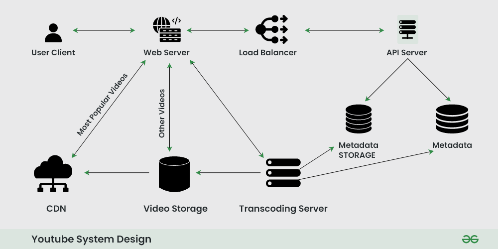

* Have you ever wondered how Netflix knows which shows you've already watched? Or how Amazon avoids showing you products you've already purchased?
### BLOOM FILTER - USED IN NETFLIX/AMAZON
It’s useful in scenarios where you need fast lookups and don’t want to use a large amount of memory, but you’re okay with occasional false positives.

https://www.youtube.com/watch?v=olfaBgJrUBI
Using a Bloom Filter for URL Checking

Imagine you're building a web crawler that needs to keep track of
which URLs it has already visited.

## High Level Design

**Hash Function and Bit Array**
Instead of storing every URL (which would require a lot of memory), you decide to use a Bloom Filter.

Step 1: Set Up the Bloom Filter
Initialize a Bit Array: Let’s assume our Bloom Filter uses a bit array of size 10, initially all set to 0.

Choose Hash Functions: We’ll use two hash functions in this example. These hash functions take an input (like a URL) and output an index in the bit array.

Adding Another URL
Now, let's add another URL, algomaster.io.

Hash Function 1 generates an index of 1 for algomaster.io.

Hash Function 2 generates an index of 4 for algomaster.io.

We set the bits at indices 1 and 4 in the bit array to 1.

## 📌🌎 Real-World Applications of Bloom Filters

1. Web Caching
2. Spam Filtering in Email Systems
3. Many databases, such as Cassandra, HBase, and Redis, 
use Bloom Filters to avoid unnecessary disk lookups for non-existent keys
4. Content Recommendation Systems like Netflix
5. Social Network Friend Recommendations
6. 
## 📚 Books`

